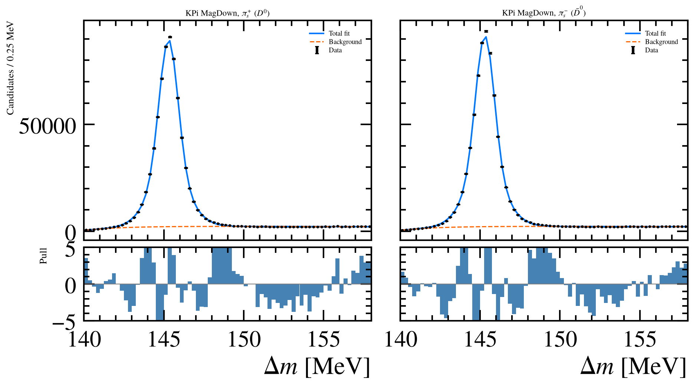

# charm-acp

A blinded reproduction of LHCb's ΔA_CP measurement method on LHCb Open Data. Contains a Kπ control measurement, the full analysis pipeline, and the diagnosis of a defect in the delivered data.

## Content

ΔA_CP = A_CP(D⁰→K⁻K⁺) − A_CP(D⁰→π⁻π⁺) is the observable LHCb used to first see CP violation in charm decays (PRL 122 (2019) 211803, [arXiv:1903.08726](https://arxiv.org/abs/1903.08726)). This repository rebuilds that analysis end to end on 151.9 pb⁻¹ of 2016 LHCb Open Data: selection, Δm fits, blinding, polarity averaging, a kinematic map, toys, a bootstrap and a systematic scan, all from one command.


*The Kπ control mode, MagDown, 1.34 M signal decays: Δm for the two flavour tags with the shared shape fits and their pulls. The 1 % difference between the two panels is the detector charge bias.*

## Result

> A_raw(D⁰→K⁻π⁺) = (−1.364 ± 0.063 (stat) ± 0.072 (syst)) %
>
> equal weight average of (−1.011 ± 0.091) % MagDown and (−1.717 ± 0.089) % MagUp, 2.74 M fitted signal decays, 151.9 pb⁻¹ of 2016 pp collisions at 13 TeV.

This is a nuisance asymmetry: D* production, K/π detection and tracking, not a CP observable. Its polarity odd part is +0.353 ± 0.063 %. LHCb's 2011+2012 Kπ raw asymmetries (Table 2 of [arXiv:1610.09476](https://arxiv.org/abs/1610.09476), statistical errors only) give a half difference of +0.419 ± 0.065 % by the same arithmetic, so this supports the sign, the scale and the ordering, but not the actual values. For scale, the published ΔA_CP is (−0.154 ± 0.029) %.

## Why there is no ΔA_CP measurement here

The KK and ππ trees of the delivered production are about 99.9 % Kπ reflections. The events they contain are ones in which the Kπ line fired, and the few candidates that survive reconstruct to the D⁰ mass under a K↔π swap. Their fitted yields come to 0.13 % of what the branching ratios predict from Kπ in the same polarities. The pipeline quotes a mode only above 30 %, so it refuses both, in the measurement and in every systematic variation. Prescales, the line configuration and the run coverage were checked and none of them accounts for the deficit, which means the data used in the selection contain the defect. No ΔA_CP number can therefore be given from this production.

## Run it

```bash
conda env create -f environment.yml
conda activate charm-acp && pip install -e . && pytest
conda run -n charm-acp python run_all.py
```

Ten to thirty minutes, `--fast` for fewer toys. The stages are a quick look at the files, per-file validation, selection and fits, the toy pull gate, the bootstrap, the (pT, η) map, run stability, referee checks and systematics. Each one is a named script in `notebooks/`. Outputs go to `results/` and `plots/`.

## Method

- **The Δm fit.** Extended binned maximum likelihood in [140, 158] MeV, 0.25 MeV bins, double Gaussian signal on the threshold background (1 − e^(−(Δm−m_π)/a))·(Δm/m_π)^b, with LHCb's (Δm−m_π)^a·e^(b·Δm) as the variation.
- **Shared shape, free mean per flavour.** Resolution, fraction and background are shared; each flavour keeps its peak position. The widths differ by 4.1 ± 0.8 keV, and freeing them is the largest systematic.
- **Selection.** PIDK > 0 on kaons and PIDK < 0 on pions, ghost probability, D⁰ mass window, prompt D⁰ (IPχ² < 9), soft pion pT, a soft pion fiducial cut at the magnet edge, one candidate per event with a seeded tie break.
- **Equal weight polarity average**, never luminosity or inverse variance weighted, because only the arithmetic mean cancels the polarity odd part.
- **Blinding.** Every CP mode asymmetry carries a hidden additive offset, the SHA-256 of a salted passphrase scaled to ±0.25. The whole error analysis ran blind. Kπ is flavour specific, so it is left open.

The control mode passes its checks. The 1000 toy pull gate returns a width of 0.995 ± 0.022, the bootstrap errors sit 1 % above the fitted ones, the result is stable across run periods (p = 0.79 and 0.78). The asymmetry is not flat over (pT, η), χ²/ndf = 38.5/19, which is carried as a systematic error. The systematic total is 0.072 %, mostly the fit model (0.053), secondary charm (0.037) and the selection (0.031); two other combination rules give 0.061 % and 0.101 %.

Not implemented from the published procedure: the m(D⁰) peaking background term, the TOS/nTOS split, φ in the kinematic matching, the Johnson S_U tail. No simulation exists for these ntuples, so every check is based on pure data.

## Data and licence

Code MIT, see [LICENSE](LICENSE). The ntuples are not redistributed here. They were made on request by the LHCb Ntupling Service: request 102, productions 00412869 (MagDown) and 00412870 (MagUp), 2016 pp at 13 TeV, Stripping 28r2, CHARM.MDST, DaVinci v46r11, four chunks, 151.91 pb⁻¹, served from CERN EOSPUBLIC under the CERN Open Data Policy (CC0). The request as submitted to CERN is in [docs/provenance/](docs/provenance/), five decay tree YAMLs and `info.yaml`, and [docs/DATA_REQUEST.md](docs/DATA_REQUEST.md) says how to ask for the same ntuples. The blinding passphrase lives in `data/.blind_passphrase` and is never committed.

## References

- LHCb, "Observation of CP violation in charm decays", PRL 122 (2019) 211803, [arXiv:1903.08726](https://arxiv.org/abs/1903.08726)
- LHCb, "Measurement of the difference of time-integrated CP asymmetries in D⁰→K⁻K⁺ and D⁰→π⁻π⁺ decays", PRL 116 (2016) 191601, [arXiv:1602.03160](https://arxiv.org/abs/1602.03160)
- LHCb, "Measurement of the time-integrated CP asymmetry in D⁰→K⁻K⁺ decays", PRL 131 (2023) 091802, [arXiv:2209.03179](https://arxiv.org/abs/2209.03179)
- LHCb, "Measurement of CP asymmetry in D⁰→K⁻K⁺ decays", PLB 767 (2017) 177, [arXiv:1610.09476](https://arxiv.org/abs/1610.09476)
- C. Aidala et al., "LHCb Open Data Ntupling Service", CHEP 2024, [arXiv:2504.00610](https://arxiv.org/abs/2504.00610)
- C. A. Aidala et al., "Ntuple Wizard", Comput. Softw. Big Sci. 7 (2023) 6, [arXiv:2302.14235](https://arxiv.org/abs/2302.14235)
- Particle Data Group, "Review of particle physics", PRD 110 (2024) 030001
- R. Barlow, "Systematic errors: facts and fictions", [arXiv:hep-ex/0207026](https://arxiv.org/abs/hep-ex/0207026)
- J. R. Klein and A. Roodman, "Blind analysis in nuclear and particle physics", Annu. Rev. Nucl. Part. Sci. 55 (2005) 141
